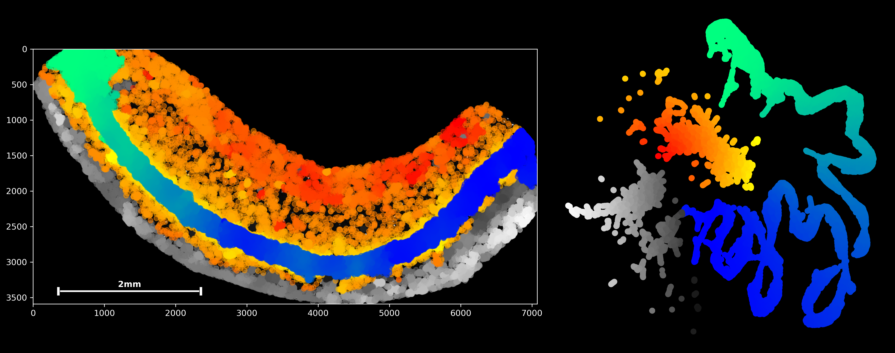

.. plankton.py documentation master file, created by
   sphinx-quickstart on Thu Jun 30 17:16:35 2022.
   You can adapt this file completely to your liking, but it should at least
   contain the root `toctree` directive.

====================
Welcome to plankton!
====================

a python-based point process analysis package.
----------------------------------------------

Plankton is a python package created to make data handling and analysis of point process data as easy as possible.

.. toctree::
   :maxdepth: 2
   :caption: Introduction:

   introduction

.. toctree::
   :maxdepth: 2
   :caption: Getting started

   rst/installation
   rst/tutorial-1-data-handling
   rst/tutorial-2-pixelmap-integration
   rst/tutorial-3-scanpy-integration
   rst/tutorial-4-exploratory-analysis
   rst/tutorial-5-statistical-modelling

.. toctree::
   :maxdepth: 2
   :caption: User guide:

   rst/spatial-data
   rst/pixel-maps
   rst/stats
   rst/graphs-embeddings
   rst/scanpy-anndata

.. toctree::
   :maxdepth: 3
   :caption: Modules:

   modules

Indices and tables
==================

* :ref:`genindex`
* :ref:`modindex`
* :ref:`search`
