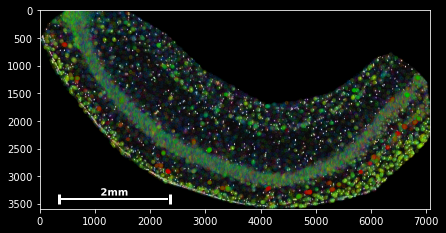

Tutorial 1: Data handling
========================

Welcome to plankton's tutorial series! 

In this first part, you will learn how to create a SpatialData object, planktons core data handling device. You will learn the basics of data manipulation and get an introduction to plankton's interactive analysis approach.

Data Preparation
----------------

You will need a data set in order to see plankton in action. For this tutorial, we will use Xiaoyan Qian's beautiful ISS scans of interneurons from the murine Hippocamupus from her `2018 publication <https://www.nature.com/articles/s41592-019-0631-4>`_. The data set contains ``42580`` detected molecule spots from ``96`` different gene classe, which is a relatively moderate size for the sake of this tutorial. 

Activate the conda environment created during the :doc:`installation` process and open the notebook ``plankton/tutorials/data-handling.ipynb``. Running the first two cells should reformat the notebook layout and load the ISS data into memory. And we're ready to go exploring!

Creating a SpatialData object
-----------------------------

The SpatialData class inherits from pandas's powerful `DataFrame <https://pandas.pydata.org/docs/reference/api/pandas.DataFrame.html>`_ implementation and shares much of its functionality. In its most basic form, SpatialData has three input parameters, all of which expect a list with one entry per detected spot: ``genes`` containing the spots' gene names (as strings) and ``x_coordinates``/ ``y_coordinates`` containing the spots' detected positions in micrometers.

Using the ISS-hippocampus data that was loaded into the notebook as a pandas DataFrame, a SpatialData initialisation would look like this:

.. code:: python3

    import plankton as pl

    sdata = pl.SpatialData(genes=xiaoyan_et_al.gene,
                           x_coordinates=xiaoyan_et_al.spotX,
                           y_coordinates=xiaoyan_et_al.spotY,)

This has created the object ``sdata``, which is ready to be used for data exploration, manipulation and analysis!

just typing ``sdata`` into a jupyter cell and executing renders a short ``HTML`` overview of sdata:

.. code:: python3

    sdata

.. raw:: html

     <table class="dataframe"> <thead> <tr style="text-align: right;"> <th></th> <th>g</th> <th>x</th> <th>y</th> <th>gene_id</th> </tr> </thead> <tbody> <tr> <td>0</td> <td>Crym</td> <td>534</td> <td>3</td> <td>23</td> </tr> <tr> <td>1</td> <td>Nrn1</td> <td>563</td> <td>3</td> <td>51</td> </tr> <tr> <td>2</td> <td>Slc24a2</td> <td>574</td> <td>3</td> <td>80</td> </tr> <tr> <td>3</td> <td>Gad1</td> <td>22</td> <td>540</td> <td>32</td> </tr> <tr> <td>4</td> <td>Gad1</td> <td>24</td> <td>538</td> <td>32</td> </tr> <tr> <td>...</td> <td>...</td> <td>...</td> <td>...</td> <td>...</td> </tr> <tr> <td>42575</td> <td>Npy</td> <td>6883</td> <td>1974</td> <td>48</td> </tr> <tr> <td>42576</td> <td>Npy</td> <td>6889</td> <td>1958</td> <td>48</td> </tr> <tr> <td>42577</td> <td>Npy</td> <td>6911</td> <td>2433</td> <td>48</td> </tr> <tr> <td>42578</td> <td>Npy</td> <td>6940</td> <td>2360</t> <td>48</td> </tr> <tr> <td>42579</td> <td>Npy</td> <td>6966</td> <td>2257</td> <td>48</td> </tr> </tbody> </table>

_

We can see that the raw ``sdata`` table contains five columns: The first ``index`` column contains a unique index number for each data spot which remains constant throughout the analysis. ``g`` contains the spots' gene label, ``x`` and ``y`` their spatial coordinates, and ``gene_ids`` an indexing integer that points ``g`` back to sdata's list of gene classes. 

Counts & statistics
-------------------

As you can see from the sdata's index, I did not lie about the total molecule count. So how about the gene count? Luckily, sdata has a field ``sdata.stats`` that contains basic gene-centric statistical information about the object. It is also implemented as a pandas DataFrame:

.. code:: python3

    sdata.stats

.. raw:: html

     <table class="dataframe" border="1"> <thead> <tr style="text-align: right;"> <th></th> <th>counts</th> <th>count_ranks</th> <th>count_indices</th> <th>gene_ids</th> </tr> </thead> <tbody> <tr> <td>3110035E14Rik</td> <td>2367</td> <td>92</td> <td>94</td> <td>0</td> </tr> <tr> <td>6330403K07Rik</td> <td>442</td> <td>65</td> <td>20</td> <td>1</td> </tr> <tr> <td>Adgrl2</td> <td>166</td> <td>58</td> <td>13</td> <td>2</td> </tr> <tr> <td>Aldoc</td> <td>1343</td> <td>89</td> <td>79</td> <td>3</td> </tr> <tr> <td>Arpp21</td> <td>528</td> <td>69</td> <td>54</td> <td>4</td> </tr> <tr> <td>...</td> <td>...</td> <td>...</td> <td>...</td> <td>...</td> </tr> <tr> <td>Trp53i11</td> <td>141</td> <td>54</td> <td>10</td> <td>91</td> </tr> <tr> <td>Vip</td> <td>62</td> <td>39</td> <td>0</td> <td>92</td> </tr> <tr> <td>Wfs1</td> <td>1734</td> <td>90</td> <td>59</td> <td>93</td> </tr> <tr> <td>Yjefn3</td> <td>1</td> <td>0</td> <td>18</td> <td>94</td> </tr> <tr> <td>Zcchc12</td> <td>56</td> <td>36</td> <td>45</td> <td>95</td> </tr> </tbody> </table>   

It contains the series of gene classes (also accessible via ``sdata.genes``) and gene counts (``sdata.counts``) alongside a few other statistical indices. This is also where the ``gene_ids`` are defined that we encountered earlier. We can see now that ``gene_ids`` can be used to map gene-wise information onto our spot data via indexing: ``sdata.genes[sdata.gene_ids]``, for example, returns the molecule-wise gene labels (and should hence be identical to ``sdata.g``). Feel free to try it out!

Basic visualization
-------------------

Easy and versatile hypothesis testing is vital for an interactive data analysis and modeling workflow, Luckily, spatial methods in the way we treat them are comparatively easy to visualize and illustrate! And people always appreciate a nice and colorful picture : ) 

SpatialData objects provide a simple ``scatter`` method for plotting spatial data:

.. code:: python3

    sdata.scatter()

..   :width: 
..   :alt: CA1 analysis

``sdata.scatter`` is build on matplotlib's scatter function, with which it shares the same keyword/argument structure:

.. raw:: html

     
 
 

<pre>sdata.scatter(color='r') </pre>
 
 
 
 

<pre>sdata.scatter(marker='x') </pre>
 
 
 
  
 
  
 
 

<pre>sdata.scatter(alpha=0.05) </pre>
 
 
 
 

<pre>sdata.scatter(c=sdata.x) </pre>
 
 
 
  
 
  
 
 

Thus, ``scatter`` provides an easy way to visualize how certain features are spatially distributed over the data points. The magic command ``%matplotlib notebook`` (executed on top of a cell) creates a panning and zooming function that allows closer data investigation. If the notebook mode becomes too fancy, you can always return to the default by executing ``%matplotlib inline``.

Spatial or not: Data Indexing
-----------------------------

The last basic feature for data handling is plankton's *indexing* functionality. It slightly deviates from standard pandas indexing in that it always applied along the vertical axis first. Standard slicing notation ``[start:stop:step]`` is supported as well as boolean indexing and integer arrays. 

The ``sdata.g.isin`` method is handy to subset the data points by comparison to a gene list. Furthermore, ``sdata.spatial`` provides a spatial view of the data set where slicing happens in the spatial domain and returns all data points located between the provided limits.

All slicing operations return a new ``SpatialData`` object, which we can use to create a single line plotting command:

.. raw:: html

     
 
 

<pre>#slice - every 100th spot: sdata[::100].scatter()</pre>
 
 
 
 

<pre>#boolean indexing for Neurod6 sdata[sdata.g=='Neurod6'].scatter()</pre>
 
 
 
  
 
  
 
 

<pre>#boolean indexing, multiple genes genes=['Wfs1', 'Plp1', 'Cplx2',] sdata[sdata.g.isin(genes)].scatter() </pre>
 
 
 
 

<pre>#spatial indexing sdata.spatial[1000:2000,500:1000].scatter()</pre>
 
 
 
  
 
  
 
    

This should have you covered with the very basics of the available slicing functionality for spatial data frames.

-------------------------------------------

Before we move on to an actual dataset analysis, here's a final excercise to combine your newly acquired knowledge of ``sdata``, ``sdata.stats``, plotting and indexing: 

.. admonition::  excercise

    Try to plot all genes that occur less than 20 times in the data set. Increase the plot marker size to 100 and pass the argument `legend=True` to the plotting function. It should be possible in a single line of code.

-------------------------------------------

solution:
#########

* We learned that ``sdata.counts`` contains a list of count data for all genes. 
* Hence, ``sdata.counts<20`` returns a boolean array, indicating for each gene whether the count is below or above 20.
* As we learned during the `stats`_ section, we can project gene-centric information onto the whole data set by indexing with ``[sdata.gene_id]``
* ``sdata.scatter`` takes the same arguments as its matplotlib equivalent, so the marker size is defined by the parameter ``s``.

So, the solution is:

.. code:: python3

    sdata[(sdata.counts<20)[sdata.gene_ids]].scatter(s=100,legend=True)

