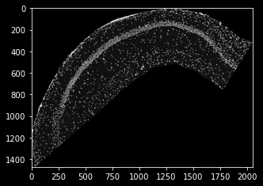
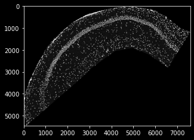
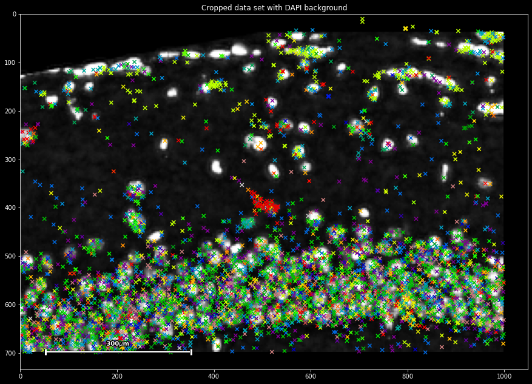
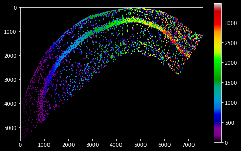

Tutorial 2: Pixel map integration
================================

Welcome to the second part of our planktonpy tutorial. In this part, we will use plankton's functionality to explore the hippocampal data set from tutorial 1. 
We will attempt to get a general overview of the data and do some basic quality control. The we will try to find spatial patterns in our data set, which we will observe more closely and treat statistically in tutorial 3.

To be able to explore the expression patterns at full depth, we will make use of all data modalities available. It the case of Xiaoyan Qian's ISS experiment, this includes:

* In-situ sequencing-derived spatial expression data (as used in tutorial 1)
* Transcription data from a single-cell RNA sequencing experiment
* Histological images that have been segmented into a pixel-based cell map

During this tutorial, we will attempt to integrate these different modalities and use them for quality control and to provide a context for our spatial observations.

Pixel maps as a plotting background
###################################

Many spot-based spatially resolved transcriptomics studies produce histological images to document the anatomy of sample slides. They are comparatively cheap to make and provide a great reference for the detected transcriptomes, all the way from experimental quality control to visualizing and contextualizing final results.

Plankton offers a PixelMaps class to integrate pixel-based spatial information (like histology stainings or tissue maps) with the spot-based data set propper. It allows for easy plotting, cropping, rescaling and data sampling. 

To follow along, start an ipython server and open the notebook *tutorials/exploratory.ipynb*  and run the first three cells to download the ISS coordinates, a DAPI background stain and a cell-map data set. 

DAPI stain is loaded into the variable ``dapi_data`` as a 2d array:

.. code:: python3

    plt.imshow(dapi_data)

Unfortunately, the resolution of the DAPI stain is not the same as the ISS coordinates from last tutorial. This is one of the use cases for the plankton.PixelMap wrapper: It accepts a scaling parameter to siplify data integration. In our case, the DAPI-image's um-per-pixel value is ``0.2694``, which we need to use as an upscaling parameter.
  
.. code:: python3

    dapi_map = pl.PixelMap(dapi_data, upscale=0.2694)
    dapi_map.imshow(cmap='Greys')

as you can see, the scale now fits the coordinate data of tutorial 1, and we're set to create a SpatialData set once again, this time providing pixel data as a plotting background. Note that, when integated into the data set, the PixelMaps are transformed alongside the sdata object (e.g. during cropping):

.. code:: python3

    sdata=pl.SpatialData(spot_data.Gene,
                     spot_data.x,
                     spot_data.y,
                    pixel_maps={'DAPI':dapi_map}
                    )

    plt.title('Cropped data set with DAPI background')
    sdata.spatial[4000:5000,500:1000].scatter(marker='x')

This immediately provides us with a first basic way of quality control: We can observe that two modalities of spot and pixel-based data integrate, with both showing spatially co-occurring signal. 

Parsing pixel map data
######################

Next to the DAPI stain, Qian et al provide a cell segmentation map, which was downloaded and saved into the variable ``cell_data``. It is an integer-based 2d array with a zonal indexing of cells areas (using ``0`` as background value). It is already in scale for our ISS data set, so no resolution adjustment is necessary:

.. code:: python3

    cell_map = pl.PixelMap(cell_data)

    #add the cell map to sdata
    sdata.pixel_maps['cells']=cell_map

    plt.colorbar()
    cell_map.imshow(cmap='nipy_spectral')

We can use the ``PixelMap.get_value`` method to acquire the pixel map data at a certain position in data-set coordinates. For our ISS data, this allows us to parse the cell map and assign every molecule the id of the cell it occurs in: 

.. code:: python3

    sdata['cell_id'] = cell_map.get_value(sdata.x,  
                                          sdata.y,
                                          padding_value=0 #assigned to off-map points
                                          )
    
    sdata

.. raw:: html

    <table class="dataframe" border="1"> <thead> <tr style="text-align: right;"> <th></th> <th>g</th> <th>x</th> <th>y</th> <th>gene_id</th> <th>cell_id</th> </tr> </thead> <tbody> <tr> <td>0</td> <td>Cxcl14</td> <td>110</td> <td>5457</td> <td>24</td> <td>51</td> </tr> <tr> <td>1</td> <td>Plp1</td> <td>0</td> <td>4735</td> <td>56</td> <td>0</td> </tr> <tr> <td>2</td> <td>Plp1</td> <td>0</td> <td>4725</td> <td>56</td> <td>0</td> </tr> <tr> <td>3</td> <td>Id2</td> <td>0</td> <td>4478</td> <td>35</td> <td>0</td> </tr> <tr> <td>4</td> <td>Enpp2</td> <td>0</td> <td>4455</td> <td>26</td> <td>0</td> </tr> <tr> <td>...</td> <td>...</td> <td>...</td> <td>...</td> <td>...</td> <td>...</td> </tr> <tr> <td>72331</td> <td>Npy</td> <td>7305</td> <td>1257</td> <td>45</td> <td>3453</td> </tr> <tr> <td>72332</td> <td>Npy</td> <td>7331</td> <td>1360</td> <td>45</td> <td>0</td> </tr> <tr> <td>72333</td> <td>Npy</td> <td>7425</td> <td>1294</td> <td>45</td> <td>0</td> </tr> <tr> <td>72334</td> <td>Npy</td> <td>7467</td> <td>1287</td> <td>45</td> <td>3474</td> </tr> <tr> <td>72335</td> <td>Npy</td> <td>7492</td> <td>1268</td> <td>45</td> <td>0</td> </tr> </tbody></table>    

This provides us with another opportunity for quality control: We can determine the ratio of molecules that were recovered within cell boundaries versus the extracellular matrix:

.. code:: python3

    intra_extra_ratio = (sdata.cell!=0).mean()
    print(f'{int(100*intra_extra_ratio)}% of cells are detected within molecule boundaries.')

.. code:: html

    '61% of molecules are detected within cell boundaries.'

You now have mastered the basics of PixelMap integration in the plankton framework!
In the next setp, we will cover the integration of external sequencing data using scanpy data frames.

