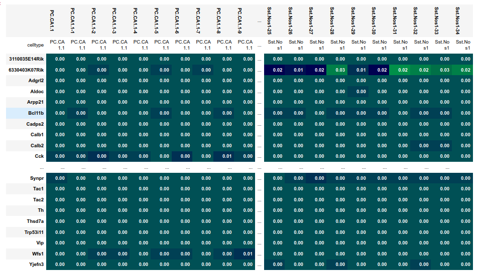
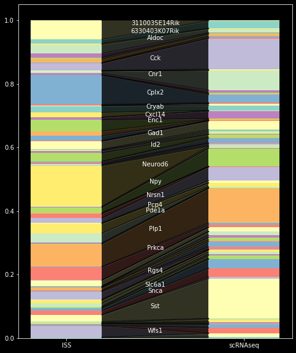
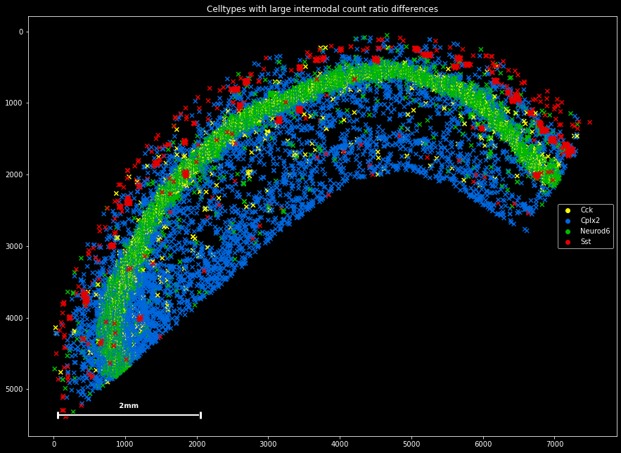
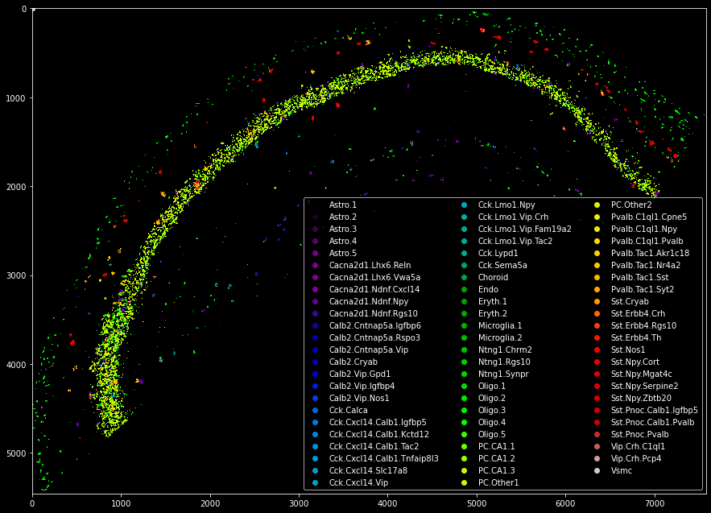

Tutorial 3: Scanpy and AnnData integration
==========================================

Next to pixel-based information, larger scale projects often generate single-cell RNA sequencing data. 
Single-cell expression information can be used to estimate the quality of the spot-based data and as a reference to infer cell identity and celltype affinity amongts single molecules.
Plankton offers an API for the `scanpy` package, which is the most abundant python-based analysis framework for single-cell expression data. 

To explore plankton's single-cell API, open the notebook `tutorials/single-cell.ipynb` and run the first three cells to download the single-cell sequencing data provided by Qian et al. It is downloaded and converted into the AnnData frame structure that's heavily used by scanpy.

.. code:: python3

    sdata = pl.SpatialData(
                      x_coordinates=spot_data.x,
                      y_coordinates=spot_data.y,
                      genes=spot_data.Gene,
                      scanpy = scRNAseq_data
                      )  
    
    sdata.scanpy

The ``AnnData`` object is added to ``sdata`` as a ``ScanpyDataFrame`` object, that strips away expresson information of genes that are absent in ``sdata``. Per default, plankton expects cell type information to be stored under ``AnnData.obs.celltype``, but a different label can be passed during object initialization.
This enables plankton to generate an expression signature matrix that's stored at ``sdata.scanpy.signatures``. The ``ScanpyDataFrape`` object also posesses a ``stats`` field with an identical format to the basic ``sdata.stats`` from tutorial 1.

A first handy step of quality control is to compare molecule count distributions in the two data modalities. Planton provides the function ``pl.hbar_compare`` for an interpretable visual representation of two ``stats`` objects:

.. code:: python3

    pd.hbar_compare(sdata.stats,
                    sdata.scanpy.stats, 
                    labels=['ISS','scRNAseq']
                    )

As the most significant result, the count comparison reveals an overabundance of *Neurod6*, and *Cpls2* and an underabundance of *Cck* and *Sst* in the spatial data set. 

We can plot the four molecules to reveal their spatial build-up:

.. code:: python3 

    misrepresented=['Neurod6','Cck','Cplx2','Sst']

    plt.title('Celltypes with large intermodal count ratio differences')

    sdata[sdata.g.isin(misrepresented)].scatter(legend=True,marker='x')

It seems that the overrepresented *Neurod2* and the underrepresented *Cck* are both expressed mainly in the tightly packed pyramidal layer, whereas the overrepresented *Cplx2* and the underrepresented *Sst* are mainly expressed by interneurons in the periphery. For now, we should accept this observation of different gene count distributions, as we cannot say whether the underlying mechanism is biological or methodological.

Such differences in gene count distributions across transcriptomics data modalities seems to re-occur across studies, and investigating the underlying mechanisms and dynamics would probably constitute an interesting research project by itself. In our case, it means that we might want to be careful when making claims about expression patterns amongst the four diverging genes. In my subjective experience, however, the signal in this sample seems comparatively stable compared to other available spot-based spatial transcriptomics data sets.

Plankton offers another feature to integrate single-cell and spatial transcriptomics data: It contains a simplified version of the SSAM algorithm by Park et al (2021) to generate preliminary cell type maps.

.. code:: python3 

    from plankton.utils import ssam

    signatures = sdata.scanpy.generate_signatures()

    celltype_map = utils.ssam(sdata,signatures.T,kernel_bandwidth=5)

.. code:: python3 

    from matplotlib import cm

    cmap = cm.get_cmap('nipy_spectral')
    handlers = [plt.scatter([0],[0],color=cmap(f)) for f in np.linspace(0,1,len(sdata.scanpy.signature_matrix.index))]
    plt.legend(handlers,sdata.scanpy.signature_matrix.index,ncol=3,loc='lower right')

    plt.imshow(celltype_map,cmap='nipy_spectral',interpolation='none')

