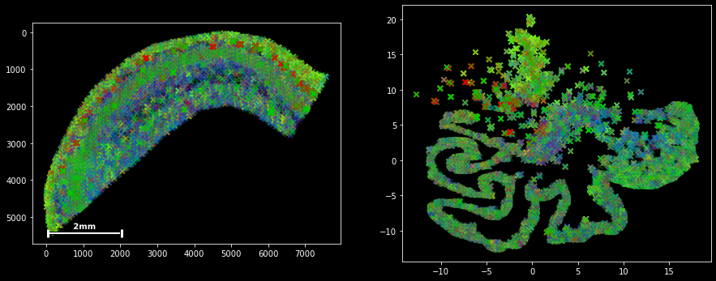
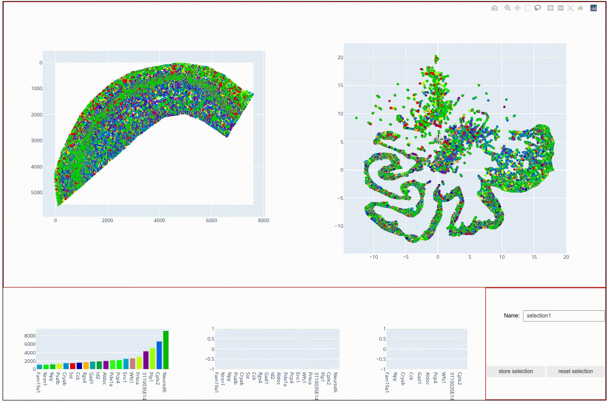
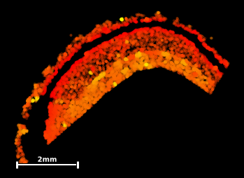
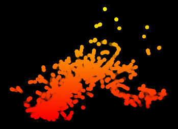
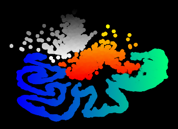
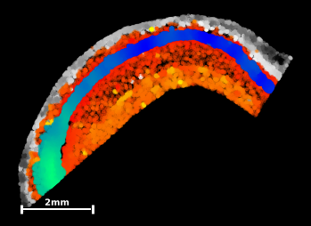

Tutorial 4: Exploratory analysis
=================================

Now that we have completed the tutorials on data handling, it is finally time to do some data analysis!
In this tutorial, we will focus on the same data set by Qian et al that we used in the last tutorials. We will use plankton's unsupervized spatial embedding routine to determine tissue structures and visualize spatio-topographical relationships in a number of scatter plots.

Recurring spatial contexts
--------------------------

Plankton uses the powerful `UMAP` embedding algorithm to retrieve recorring spatial contexts in the molecular topography. To this end, an individual model of the immediate environment is created per molecule spot. A KNN graph is generated around each spot and the distance-weighted counts of genes is stored as a vector. UMAP uses these vectors to create an easy to visualize 2d embedding.

To be able to run this tutorial, open the notebook `tutorials/exploratory.ipynb`, run the first cells to load the data set and initialize an sdata object:

.. code:: python3

    sdata = pl.SpatialData(
                      x_coordinates=spot_data.x,
                      y_coordinates=spot_data.y,
                      genes=spot_data.Gene,
                      )      

All graph-based analysis takes place in the ``sdata.graph`` object, that contains a k-nearest-neighbor graph and a few convenience functions for graph-based topographical analysis and visualization.

To update the interal knn graph, run the function:

.. code:: python3

    sdata.graph.update_knn(n_neighbors=200)

This function calculates a 200-nearest neighbor graph and stores the data in the ``sdata.graph`` object.
For our particular use case, the number of neighbors should be large enough to create a representative model of the local environment. In general, the larger the knn graph, the better - within the limits of your computational resources.  

Now, we can create local environment models and run the UMAP algorithm:

.. code:: python3

    #environment model building parameters:
    bandwidth   = 60 #bandwidth of distance weight discount effect
    zero_weight = 1  #regularization parameter

    #UMAP parameters:
    n_neighbors = 30
    min_dist    = 0.03

    sdata.graph.run_umap(
                bandwidth=bandwidth,
                zero_weight=zero_weight
                n_neighbors=n_neighbors, 
                min_dist=min_dist,)

The function should complete within a couple of minutes. It creates a 2d array of embedding coordinates and stores it in ``sdata.graph.umap``.

We can inspect the generated embedding using the function ``umap_paired``:

.. code:: python3

    sdata.graph.map_and_umap(marker='x',alpha=0.5)

Both the tissue map on the left and the embedding on the eight show molecules colored by gene label. We can already vaguely discern three main structures in the embedding: 

* A compact, light-green cluster at the top
* a compact, green-blue cluster in the middle, and 
* an elongated, dark-green structure at the bottom.  

All in all, the above representation is most suitable for plotting, where the parameters can be changed using the generic matplotlib arguments and syntax.
For a more interactive approach, plankton offers a javascript-based data viewer with a similar layout. It is created as follows:

.. code:: python3

    sdata.graph.umap_js()

It also shows a scatter point map representation of the ``sdata`` coordinates on the left and the umap embedding on the right. Both maps offer a number of tool that help investigating the data, such as zooming and panning. The interface also offers *lassoo and box selecton tools* that can be used to select data points in either of the two panels, with the selected molecules being highlighted in both panels. Bar charts on the bottom show the most abundant molecules in the selection. Try to play around with the data to find topographical expression patterns. 

When highlighted in the js viewer, the above-mentioned cluster structures seem to indeed represent spatially coherent tissue regions. In the next step, we want to store these regions for further plotting and statistical investigation. 

To do this, select the central cluster (like in the screen capture above), type the name 'radiatum' into the *Name* text field and hit the *store selection* button. The js viewer now added the selection as a boolean column to our ``sdata`` data frame:

.. raw:: html

     <table border="1" class="dataframe"> <tdead> <tr style="text-align: right;"> <th></th> <th>g</th> <th>x</th> <th>y</th> <th>gene_id</th> <th>radiatum</th> </tr> </tdead> <tbody> <tr> <td>0</td> <td>Cxcl14</td> <td>110</td> <td>5457</td> <td>24</td> <td>False</td> </tr> <tr> <td>1</td> <td>Plp1</td> <td>-1</td> <td>4735</td> <td>56</td> <td>False</td> </tr> <tr> <td>2</td> <td>Plp1</td> <td>-1</td> <td>4725</td> <td>56</td> <td>False</td> </tr> <tr> <td>3</td> <td>Id2</td> <td>-1</td> <td>4478</td> <td>35</td> <td>False</td> </tr> <tr> <td>4</td> <td>Enpp2</td> <td>-1</td> <td>4455</td> <td>26</td> <td>False</td> </tr> <tr> <td>...</td> <td>...</td> <td>...</td> <td>...</td> <td>...</td> <td>...</td> </tr> <tr> <td>72331</td> <td>Npy</td> <td>7305</td> <td>1257</td> <td>45</td> <td>False</td> </tr> <tr> <td>72332</td> <td>Npy</td> <td>7331</td> <td>1360</td> <td>45</td> <td>False</td> </tr> <tr> <td>72333</td> <td>Npy</td> <td>7425</td> <td>1294</td> <td>45</td> <td>False</td> </tr> <tr> <td>72334</td> <td>Npy</td> <td>7467</td> <td>1287</td> <td>45</td> <td>False</td> </tr> <tr> <td>72335</td> <td>Npy</td> <td>7492</td> <td>1268</td> <td>45</td> <td>False</td> </tr> </tbody> </table> 
72336 rows × 5 columns
 

This boolean column denotes category membership and can be used for plotting color assignment or dataset subselecting:

.. code:: python3

    sdata_radiatum = sdata[sdata.radiatum]

    sdata_radiatum

.. raw:: html

    <table border="1" class="dataframe"> <tdead> <tr style="text-align: right;"> <th></th> <th>g</th> <th>x</th> <th>y</th> <th>gene_id</th> <th>radiatum</th> </tr> </tdead> <tbody> <tr> <td>1169</td> <td>Nrn1</td> <td>204</td> <td>4448</td> <td>48</td> <td>True</td>  </tr> <tr> <td>1173</td> <td>Nrn1</td> <td>205</td> <td>4458</td> <td>48</td> <td>True</td>  </tr> <tr> <td>1174</td> <td>Nrn1</td> <td>205</td> <td>4449</td> <td>48</td> <td>True</td>  </tr> <tr> <td>1187</td> <td>Nrn1</td> <td>210</td> <td>4453</td> <td>48</td> <td>True</td>  </tr> <tr> <td>1202</td> <td>Id2</td> <td>214</td> <td>4323</td> <td>35</td> <td>True</td>  </tr> <tr> <td>...</td> <td>...</td> <td>...</td> <td>...</td> <td>...</td> <td>...</td> </tr> <tr> <td>72138</td> <td>Npy</td> <td>5985</td> <td>1343</td> <td>45</td> <td>True</td>  </tr> <tr> <td>72140</td> <td>Npy</td> <td>5991</td> <td>1348</td> <td>45</td> <td>True</td>  </tr> <tr> <td>72142</td> <td>Npy</td> <td>6002</td> <td>1357</td> <td>45</td> <td>True</td>  </tr> <tr> <td>72164</td> <td>Npy</td> <td>6243</td> <td>1550</td> <td>45</td> <td>True</td>  </tr> <tr> <td>72174</td> <td>Npy</td> <td>6324</td> <td>1634</td> <td>45</td> <td>True</td>  </tr> </tbody> </table>

The idea for the rest of this tutorial is to plot the three subsections on top of each other, each with a different colormap, to visualize the spatial relations within and across the detected clusters. To this end, please:

* Select the topmost,light-green cluster and give it the name 'alveus'
* Through selection (or using boolean logic with the other two clusters) store the large, elongated structure in the column 'pyramidal'.
* Just like ``sdata_radiatum`` above, create two new sdata sets ``sdata_alveus`` and ``sdata_pyramidal``.

The UMAP output coordnates are stored as an *n . 2* array under ``sdata.graph.umap``. X-coordinates are stored in the first column, y-coordinates in the second.

The coodinate subsets can now be plotted using ``sdata.scatter`` and ``sdata.graph.plot_umap()`` with the respective arguments for ``c`` and ``cmap``:

.. raw:: html

    
 
 
 
 <pre>#extract umap's y-coordinates:
    umap_y = sdata_radiatum.graph.umap[:,1]

    #plot umap with color grading:
    sdata_radiatum.graph.plot_umap(c=umap_y
                            cmap='autumn')
    </pre></pre> 
 
 
 
 
 
 <pre>   #plot umap-y in tissue coordinates sdata_radiatum.scatter(c=umap_y
                            cmap='autumn')</pre> 
 
 
 
  
 
  

 

This exploratory result provides us with a few hypotheses that we could test during further analysis:

* The stratum radiatum is detected as two distinct and connected structures around a central gap. 

* The main topographical feature determining local molecular composition appears to be the proximity to the central gap, with gap-proximal molecules being displayed in the southernmost part of the UMAP. 

* A few outliers (bright yellow) do seem to embedded in the radiatum matrix but form islets with a distinct molecular composition of their own. 

In the next step, add scatterplots of the other two data subsets to the output figure, giving 'alveus' a y-axis gradient with the colormap 'Greys', and 'pyramidal' an x-axis gradient with the colormap 'winter' (you can remove unnecessary scalebars through the argument ``scalebar=False``).

The final output should look something like this:

Aren't we lucky to work in such a visually appealing field : )
Our whole-genome-sequencing friends might have a harder time producing pretty pictures like this...

But this output also gives us a few more observatons that could be tested in upstream analysis:

* The pyramidal layer shows a distinct molecular composition to the other two tissue types and is easily seperable in the UMAP representation

* The molecular build-up along the sagital axis of the pyramidal layer (left-to-right in sample coordinates) seems to be locally distinct enough at all points that the elongated structure can be entirely recreated from local molecular compositions only.

* alveus seems to be more spatially coherent, with spots that lie 'deeper' within the layer being represented in the north of the umap. 

Now that we have acquired somewhat of an overview of the spatial bulid-up of the data set and have developed a few hypotheses, we will move on to more concrete spatio-statistical analysis in the following tutorial section. So long!